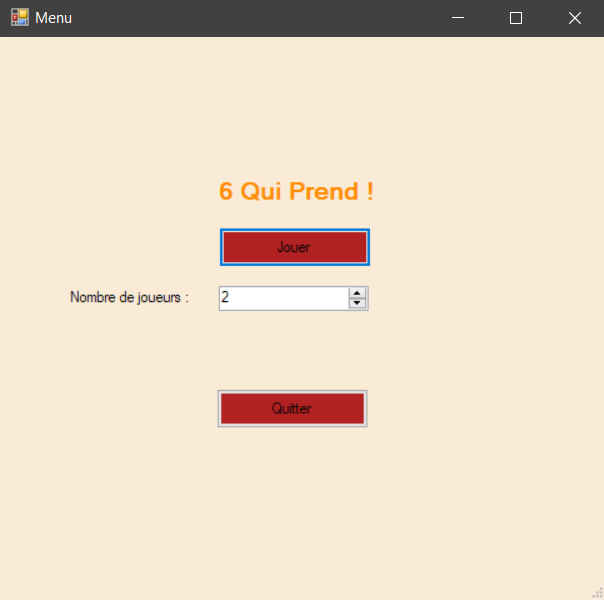
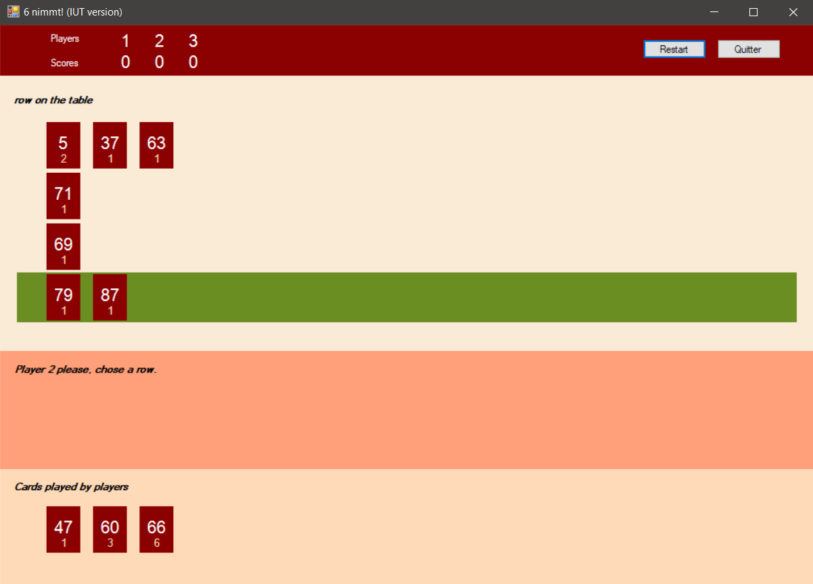

# 6-qui-prend

# Sommaire

* 1 [Présentation](#1)
* 2 [Outils Utilisés](#2)
* 3 [Résultats](#3)

<h1 id="1">1. Présentation</h1>

Application reprenant le jeu 6 qui prend.

<h1 id="2">2. Outils Utilisés</h1>

* ``C#``

<h1 id="3">3. Résultats</h1>

Menu du Jeu
 

Visuel d'une partie en cours
 

